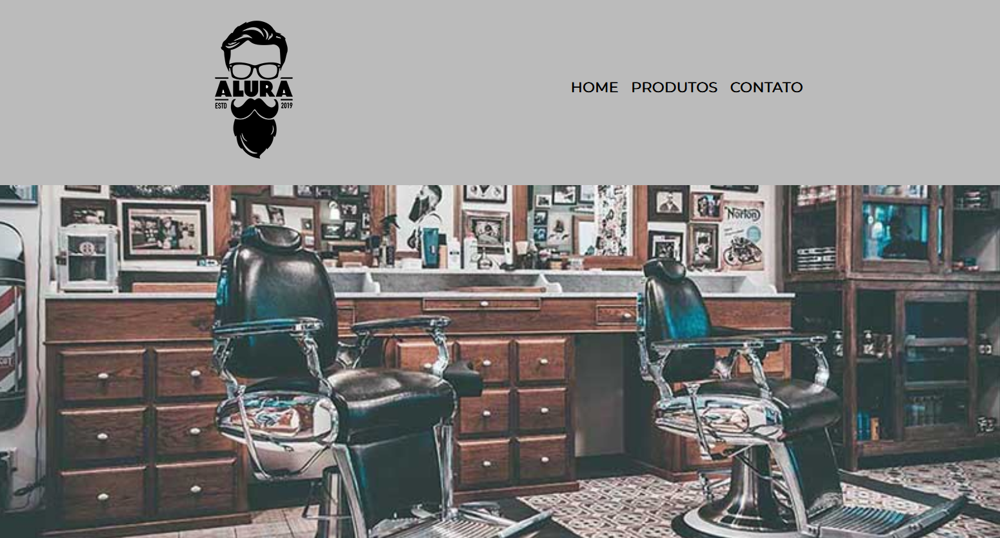

> [!CAUTION]
> **Aviso:** Este projeto é antigo e foi preservado apenas para fins de portfólio. Não há planos para correções de bugs ou novas funcionalidades.

# 💈Barbearia Alura

Este projeto é um site estático desenvolvido para uma barbearia fictícia, criado como parte da formação inicial em HTML5 e CSS3 da **Alura** em parceria com o programa **Oracle Next Education (ONE)**.

O objetivo principal foi aplicar conceitos fundamentais de desenvolvimento web, criando uma interface responsiva, semântica e visualmente agradável.

## 🚀 Funcionalidades

O site é composto por três páginas principais:
- **Home:** Apresentação da barbearia, missão, localização (com Google Maps integrado) e uma seção de benefícios com vídeo institucional.
- **Produtos:** Vitrine de serviços oferecidos (Cabelo, Barba e Combo) com preços e descrições.
- **Contato:** Formulário completo para agendamento e informações, incluindo uma tabela com os horários de funcionamento.

## 💻 Como Visualizar

O projeto pode ser acessado diretamente através do GitHub Pages: 👉 https://raphaelsette.github.io/alura-barbershop/

## 🛠️ Tecnologias Utilizadas

- **HTML5:** Estruturação semântica do conteúdo.
- **CSS3:** Estilização avançada, incluindo:
  - Uso de **Flexbox** e **Inline-block** para posicionamento.
  - **Pseudo-classes** e **Pseudo-elementos** (ex: `:hover` e `::before`).
  - **Responsividade** via Media Queries para adaptação em dispositivos móveis.
  - Transições e transformações para efeitos visuais.
- **Google Fonts:** Integração da fonte 'Montserrat'.
